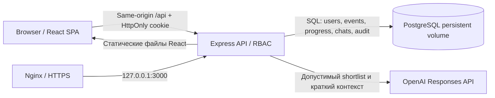
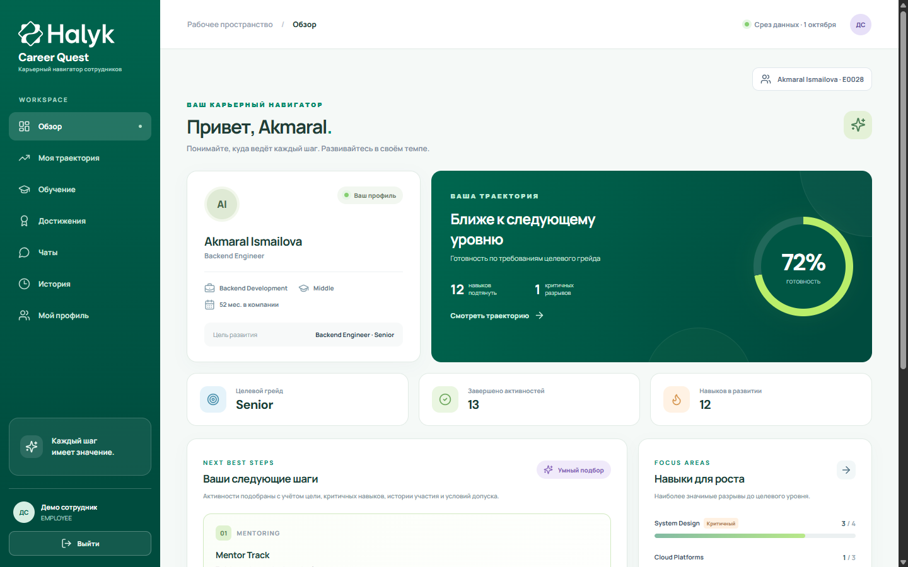
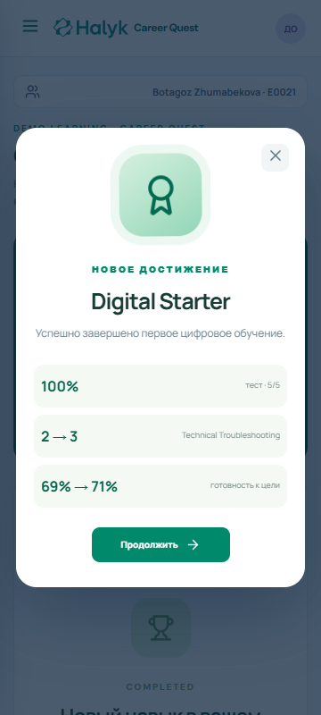
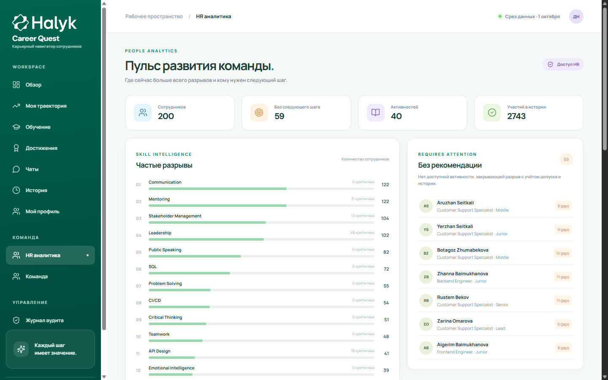
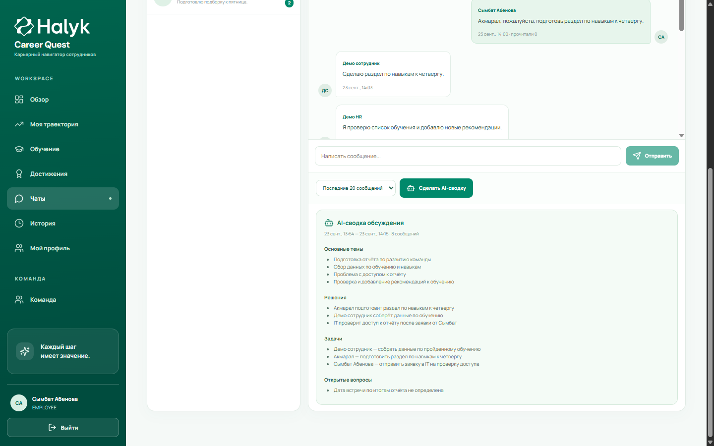

# Halyk Career Quest

Сотрудники часто получают разрозненные уведомления об обучении и не видят, как конкретная активность помогает перейти к следующему грейду. **Halyk Career Quest** превращает требования роли, skill gaps и историю участия в понятную карьерную траекторию и 1–3 объяснимых следующих шага. Сотрудник может пройти короткое обучение, сдать тест и увидеть рост навыка и готовности. HR и руководитель видят прогресс команды; рабочие чаты получают краткие AI-сводки.

Это демонстрационный продукт команды **A&B Systems** для кейса **Halyk Bank** на **HackAlem AI**. Исходные HR-данные синтетические. OpenAI помогает ранжировать допустимые карьерные мероприятия и составлять сводки доступных пользователю сообщений; правила допуска, пересчёт навыков и проверка прав выполняются на backend.

```text
Employee → Skill Gap Analysis → AI Recommendation → Learning Activity → Quiz
         → Achievement → Skill Progress → Career Readiness → HR / Manager Analytics

Corporate Chat → OpenAI AI Summary → Manager / HR / Supervisor
```

## Что умеет продукт

- Карьерная траектория до следующего грейда, critical skills и skill gaps.
- 1–3 объяснимых рекомендации с учётом грейда, prerequisites, развиваемых навыков и истории участия; mandatory/compliance исключаются.
- Демо-курс из четырёх уроков и пяти вопросов, пересчёт навыка, готовности и достижение после успешного quiz.
- HR Analytics, импорт проверочных `employees.json` и `activity_history.csv`.
- ADMIN/HR/EMPLOYEE и бизнес-роли с проверкой RBAC в API; панель администратора.
- Личный профиль, аватар, история входов, кадровое редактирование и журнал аудита.
- Личные и групповые корпоративные чаты, read/unread, OpenAI-сводки для уполномоченных ролей.
- Адаптивный интерфейс для desktop, tablet и смартфона шириной от 360px.

## Technology Stack

| Слой | Реальная технология |
|---|---|
| Frontend | React 19, Vite 7, TypeScript, CSS, Lucide icons |
| Backend / API | Node.js 22, Express 5, TypeScript |
| Database | PostgreSQL 16 (`pg`), возможен Supabase PostgreSQL |
| AI | OpenAI Responses API (`gpt-4.1-mini` по умолчанию) |
| Auth | Серверные сессии в PostgreSQL, `HttpOnly` cookie, salted `scrypt` |
| Обновление чатов | Polling каждые 5 секунд |
| Infrastructure | Multi-stage Dockerfile, Docker Compose, Nginx reverse proxy на VPS |

## Architecture



Backend детерминированно вычисляет skill gaps, правила допуска к мероприятиям, `gain/max_level`, готовность и все ограничения RBAC. В OpenAI уходит только shortlist подходящих мероприятий либо ограниченное окно сообщений после проверки доступа. Весь датасет модели не передаётся. Без ключа карьерные рекомендации продолжают работать по правилу ранжирования; AI-сводки показывают явную ошибку настройки вместо выдуманного результата.

## Брендинг Halyk

Логотипы и favicon сохранены без изменения из HTML и assets [официального сайта Halyk](https://halykbank.kz/ru): [основной логотип](https://halykbank.kz/storage/app/uploads/public/6a5/75a/f7a/6a575af7a9880610279451.svg), [белый логотип](https://halykbank.kz/themes/halyk/assets/images/logo-w.svg), [SVG favicon](https://halykbank.kz/themes/halyk/assets/favicon/favicon.svg) и [ICO favicon](https://halykbank.kz/themes/halyk/assets/favicon/favicon.ico). Локальные копии находятся в `public/brand/`, чтобы интерфейс и вкладка браузера работали после clone без обращения к сайту банка. Товарные знаки и бренд-материалы Halyk принадлежат их правообладателю и используются в рамках hackathon demo.

## QUICK START — запуск после clone

Нужны Docker Desktop либо Docker Engine с Compose и свободный локальный порт `3000`. Docker сам поднимет PostgreSQL с постоянным volume; Node.js на машине не нужен.

```bash
git clone https://github.com/BAITC-Hacks/hack-f02d3fd7-a-b-systems.git
cd hack-f02d3fd7-a-b-systems
cp .env.example .env
docker compose up --build -d
docker compose ps
curl http://localhost:3000/api/health
```

В PowerShell используйте `Copy-Item .env.example .env`, а для проверки `curl.exe http://localhost:3000/api/health`. Откройте **http://localhost:3000**. Ответ health должен содержать `"ok":true,"database":"ready"`. Для локального показа шаблонный пароль БД работает сразу; **на VPS замените его до запуска**. `.env` исключён из Git. `docker compose down` сохраняет данные; `docker compose down -v` удаляет volume и все внесённые изменения.

При старте сервер применяет `server/schema.sql` и, если БД пуста, импортирует 200 сотрудников, 40 событий, 60 навыков, 32 профиля ролей и 2743 записи участия. Учетные записи и пять демонстрационных чатов создаются при первом запуске даже при обновлении ранее созданной БД. Повторный запуск сохраняет профили, пользователей, сообщения, аудит и историю.

## Проверка за 5 минут

1. **Employee / `learning`:** войдите с паролем из таблицы ниже. Откройте обзор, skill gaps, траекторию и рекомендованное обучение. Пройдите четыре урока и quiz (4 из 5 верных ответов). Проверьте **Digital Starter**, рост Technical Troubleshooting `2 → 3` и готовности `69% → 71%` на чистой БД.
2. **Manager / `manager`:** откройте «Команда» и «Чаты» → «Команда Backend Development». Нажмите «Сделать AI-сводку» и проверьте темы, задачи и открытые вопросы. Требуется `OPENAI_API_KEY`; сохранённая сводка появляется снова после входа.
3. **HR / `hr`:** откройте HR Analytics, частые разрывы, сотрудников без следующего шага и результаты обучения `E0021`. В «Команда» проверьте кадровые поля.
4. **ADMIN / `admin`:** откройте «Администрирование», список и роли пользователей, затем «Журнал аудита». Попробуйте поиск и фильтры.

После прохождения курса учётная запись `learning` останется в статусе completed: прогресс хранится в PostgreSQL. Для повторения с исходного состояния используйте новую БД или отдельный Docker Compose project.

## DEMO ACCOUNTS

Это **публичные демонстрационные** пароли для проверочного стенда. Введите логин **или** email и пароль на странице входа. Они не являются данными доступа к VPS или production-инфраструктуре.

| System / business role | Login | Password | Что проверить |
|---|---|---|---|
| ADMIN / COMPANY_EMPLOYEE | `admin` | `DemoAdmin!2026` | Пользователи, роли, полный аудит, HR Analytics |
| HR / HR_SPECIALIST | `hr` | `DemoHR!2026` | HR Analytics, импорт, кадровые изменения, результаты обучения |
| EMPLOYEE / COMPANY_EMPLOYEE | `employee` | `DemoEmployee!2026` | Собственный профиль `E0028`, рекомендации, траектория, чат |
| EMPLOYEE / COMPANY_EMPLOYEE | `learning` | `DemoLearning!2026` | Курс `E0021`, quiz, skill progress, achievement |
| EMPLOYEE / DEPARTMENT_MANAGER | `manager` | `DemoManager!2026` | Подчинённые, рабочий чат, AI-сводка |
| EMPLOYEE / CONTACT_OPERATOR | `operator` | `DemoOperator!2026` | Диалог с клиентом и супервизором |
| EMPLOYEE / CONTACT_SUPERVISOR | `supervisor` | `DemoSupervisor!2026` | Диалоги команды и общая AI-сводка обращений |
| EMPLOYEE / CONTACT_CLIENT | `client` | `DemoClient!2026` | Только собственные чаты с оператором и профиль |

Пароли хранятся в PostgreSQL как salted `scrypt`-хеши; исходный текст в БД не сохраняется. Администратор может изменить пароль через панель. Демо-пароли нужно заменить перед доступом с других машин.

## Роли, вход и проверка доступа

- **ADMIN**: полный доступ к Career Quest и разделу «Администрирование». Может создавать и редактировать пользователей, менять роли, статус, пароль и связь с employee. Может завершать активности для демонстрации.
- **HR**: видит сотрудников, их развитие и HR-аналитику, загружает проверочные файлы. Не может управлять пользователями или завершать активность от имени сотрудника.
- **EMPLOYEE**: видит только привязанный HR-профиль. Переключатель сотрудников и разделы HR/ADMIN отсутствуют; прямые вызовы чужого API возвращают `403`.

После успешного входа браузер получает серверную сессию в `HttpOnly`, `SameSite=Strict` cookie. Сессия действует 7 дней и сохраняется при перезагрузке. «Выйти» внизу меню удаляет сессию на сервере. Деактивация, изменение роли/связи и смена пароля также завершают текущие сессии пользователя. У неавторизованных запросов к приватному API ответ `401`; для недостаточной роли — `403`. React скрывает недоступные разделы, но права проверяет сам Express для каждого запроса. Сессии хранятся в PostgreSQL, cookie содержит случайный токен, в БД хранится только SHA-256 токена. Для HTTPS cookie получает флаг `Secure`; запросы с чужим `Origin` на изменение данных отклоняются.

Учетная запись в `users` и HR-профиль в `employees` — разные сущности. Поле `users.employee_id` может быть пустым у ADMIN, HR и внешнего клиента контакт-центра. Для остальных EMPLOYEE связь обязательна и уникальна. Два пользователя не могут ссылаться на один employee. Импорт сотрудника сам по себе не создает учетную запись.

### Roles & Security — матрица прав

| Feature | Employee | Manager | HR | Operator | Supervisor | Admin |
|---|---|---|---|---|---|---|
| Собственный профиль и активность | ✓ | ✓ | Профиль | ✓ | ✓ | ✓ |
| Карьерные данные других | — | Прямые подчинённые | Все | — | Прямые подчинённые | Все |
| HR Analytics и импорт | — | — | ✓ | — | — | ✓ |
| Кадровое редактирование | — | — | ✓ | — | — | ✓ |
| Личные/групповые чаты | ✓ | ✓ | ✓ | ✓ | ✓ | Клиенты только с операторами |
| AI-сводка доступного чата | — | ✓ | ✓ | — | ✓ | ✓ |
| Журнал аудита | Свои безопасные поля | Свои безопасные поля | Кадровые поля | Свои безопасные поля | Свои безопасные поля | Все события |
| Управление пользователями и ролями | — | — | — | — | — | ✓ |

Роль проверяется на сервере для каждого запроса к профилю, сотруднику, чату, AI-сводке и административному действию; скрытие кнопки в React не считается защитой. Пароли хранятся как salted `scrypt`, сессии — в PostgreSQL, cookie `HttpOnly`/`SameSite=Strict` и `Secure` за корректно настроенным HTTPS proxy. Запросы на запись с чужим `Origin` отклоняются. Секреты берутся из локального `.env` и не передаются React; `.env` исключён из Git и Docker build context.

### Проверка под каждой ролью

1. **ADMIN**: войдите как `admin`, откройте «Администрирование». Проверьте список, поиск по имени/email/ID, фильтры роли/статуса, редактирование и создание. Откройте HR-аналитику и любой профиль.
2. **HR**: выйдите и войдите как `hr`. Проверьте все профили, рекомендации, HR-дашборд и импорт. Раздела администрирования нет. Прямой `GET /api/admin/users` возвращает `403`; `POST /api/employees/:id/complete` также `403`.
3. **EMPLOYEE**: войдите как `employee`. Доступен только `E0028` (Akmaral Ismailova), ее навыки, история и рекомендации. HR и администрирование скрыты. `GET /api/employees/E0001` и `GET /api/hr/dashboard` возвращают `403`.
4. Выйдите. `GET /api/bootstrap`, `/api/auth/me` и приватные маршруты теперь возвращают `401`.

### Создание и привязка пользователя

Войдите как ADMIN → **Администрирование** → **Добавить**. Введите имя, логин (3–40 латинских букв/цифр/`._-`), email, системную и бизнес-роль, первоначальный пароль (10–200 символов). Для обычного EMPLOYEE выберите существующий профиль в списке; ADMIN, HR и внешний клиент могут оставить связь пустой. Сохраните и войдите под новой учетной записью. В действиях строки доступны **Изменить**, **Пароль**, **Отключить/Активировать**, а также исправление даты рождения с записью в аудит. Последнего активного ADMIN отключить или понизить нельзя. Уникальность логина, email и связи с employee проверяется базой.

## Личный профиль, кадровые права и аудит

Откройте **«Мой профиль»** из меню. Здесь отображаются имя учетной записи, email/логин, системная и бизнес-роль, кадровые данные, последние посещение и входы (успешные и неуспешные), а также разрешённая пользователю история изменений. Можно загрузить PNG/JPEG/WebP аватар до 2 МБ, изменить телефон, текст «О себе», предпочитаемый язык и пароль. Аватар хранится в PostgreSQL; пароль заменяется salted `scrypt`-хешем, другие сессии отзываются. Дату рождения пользователь может самостоятельно заполнить **один раз**; последующие исправления делают HR или ADMIN с записью старого и нового значения в аудит. Предпочитаемый язык сохраняется в профиле; перевод всего интерфейса пока не реализован.

Сотрудник не может самостоятельно изменить ФИО, логин/email, должность, подразделение, руководителя, грейд, дату приёма, формат работы, системную или бизнес-роль. Попытка прямого `PATCH /api/me/profile` с любым из этих полей получает `403`. HR и ADMIN редактируют кадровые поля в разделе **«Команда»**; ADMIN отдельно управляет учетными данными и ролями в **«Администрирование»**. Руководитель и супервизор могут видеть своих прямых подчинённых, но не редактировать кадровые поля. Изменения ФИО сотрудника через HR синхронизируются со связанной учетной записью.

`audit_logs` — отдельный журнал действий backend: кто, когда и чьё поле изменил, старое/новое значение и источник запроса. Изменение профиля, кадровых полей, учетных данных, даты рождения, аватара и пароля регистрируется при записи. Значения паролей, хешей, токенов и секретов в журнал не попадают. ADMIN видит полный журнал с фильтрами по периоду, цели, инициатору, действию, типу объекта и поиском. HR видит только разрешённые кадровые изменения. Сотрудник видит в «Мой профиль» только безопасную историю собственных данных. `login_history` хранит время, успех/ошибку, IP и user agent входа отдельно от журнала полей. `audit_logs` защищён SQL-триггером от UPDATE/DELETE, а API не предоставляет операцию удаления.

## Корпоративные чаты и бизнес-роли

Системные роли **ADMIN / HR / EMPLOYEE** отвечают за доступ к API. Отдельная бизнес-роль задаёт контекст общения: **COMPANY_EMPLOYEE**, **HR_SPECIALIST**, **DEPARTMENT_MANAGER**, **CONTACT_OPERATOR**, **CONTACT_SUPERVISOR**, **CONTACT_CLIENT**. Она назначается ADMIN и проверяется сервером при поиске собеседников, создании чата, чтении, отправке сообщений и AI-сводках.

| Бизнес-роль | Возможности в чатах |
|---|---|
| COMPANY_EMPLOYEE | Личные диалоги с сотрудниками, чат своей команды |
| DEPARTMENT_MANAGER | Рабочая группа подчинённых, сводка обсуждения, просмотр команды |
| HR_SPECIALIST | Чаты с сотрудниками и руководителями, HR-права по системной роли |
| CONTACT_OPERATOR | Диалог с клиентом и своим супервизором, рабочий чат контакт-центра |
| CONTACT_SUPERVISOR | Чаты команды, просмотр рабочих диалогов операторов без права писать от их имени, общая сводка обращений |
| CONTACT_CLIENT | Только собственные чаты с операторами и личный профиль; HR и карьерные данные недоступны |

В **«Чаты»** можно начать личный диалог или группу, искать разрешённых участников, отправлять сообщения, видеть число непрочитанных и отмечать прочитанным. Сообщения сохраняются в PostgreSQL; интерфейс обновляет их каждые 5 секунд. Демо-чаты с готовой перепиской появляются при первом запуске. Прямой API-запрос к чужому чату возвращает `403`. Для супервизора просмотр диалога оператора с клиентом доступен только если оператор является его прямым подчинённым; отправка сообщения в этот диалог запрещена.

**AI-сводки** используют реальный OpenAI Responses API и требуют `OPENAI_API_KEY` в `.env`. Руководитель может свести рабочее обсуждение команды, HR — доступный групповой чат, супервизор — отдельный рабочий диалог или обращения команды. Доступны последние 20/50 сообщений, сообщения за сегодня и непрочитанные; «непрочитанные» в общей сводке супервизора означают сообщения после последней общей сводки. Результат структурирован: темы, решения, задачи и открытые вопросы. Система просит модель брать факты только из переписки, не придумывать сроки или оценки людей. Сообщения с признаками секретов скрываются перед отправкой в OpenAI; запрос выполняется только на backend с `store:false`. Результат и охваченный период сохраняются в PostgreSQL. Без ключа endpoint возвращает `503` и объяснение, выдуманная сводка не показывается.

### Сценарии для жюри: профиль, чат, сводка и аудит

1. Войдите как `employee`. Откройте **«Мой профиль»**, измените «О себе» и телефон, при желании добавьте аватар. Обновите страницу: изменения останутся. Попробуйте изменить дату рождения один раз; после сохранения поле заблокировано. Кадровые поля доступны только для просмотра.
2. Откройте **«Чаты» → «Команда Backend Development»**, прочитайте переписку, отправьте сообщение, отметьте прочитанным. Войдите как `manager`, откройте этот чат и создайте **AI-сводку**: проверьте реальные темы/поручения, отсутствие выдуманного срока встречи и сохранённую сводку после повторного входа. Под `employee` кнопки сводки нет, а прямой API-запрос вернёт `403`.
3. Войдите как `client` и откройте диалог с `operator`; внешний клиент не видит карьерное меню. Под `operator` ответьте клиенту. Под `supervisor` откройте **«Контакт-центр»**: прочитайте обращение оператора в режиме просмотра и создайте **«Сводка диалогов команды»**. Система показывает темы, задачи и открытые вопросы без рейтингов сотрудников.
4. Войдите как `hr`, откройте **«Команда»**, исправьте тестовое кадровое поле и верните исходное значение. В **«Журнал аудита»** найдите обе записи. Под `admin` проверьте полный аудит и назначение бизнес-роли в «Администрирование». Под `employee` собственные безопасные изменения видны в «Мой профиль», но журнал всей компании недоступен.

**Короткий сквозной показ:** `learning` → «Мой профиль» (аватар/«О себе») → «Обучение» → quiz и Digital Starter → `employee` пишет `manager` через «Чаты» → `manager` открывает «Команда Backend Development» и нажимает «Сделать AI-сводку» → `hr` смотрит обучение и карьерный прогресс в HR-аналитике. Для шага со сводкой добавьте `OPENAI_API_KEY` в локальный `.env`; остальные шаги доступны сразу после запуска.

## Как проверить Career Quest

Для повторяемой демонстрации используется дата среза датасета **2026-10-01**, даже если дата ОС другая.

1. Войдите как EMPLOYEE. На «Обзоре» открыт `E0028`, Backend Engineer, Middle. Без явной цели система строит путь к Senior.
2. Посмотрите «Ваши следующие шаги»: 1–3 мероприятия с объяснением, приростом навыков, форматом и ближайшей сессией. Вкладка «Моя траектория» показывает текущие/требуемые уровни и критичные разрывы; «История» показывает `completed`, `no_show`, `declined`, `dropped` и другие статусы.
3. Нажмите **«Отметить выполненной»** на доступной активности. После ответа API появляются запись `completed`, новые уровни с учетом `gain/max_level` и обновленный процент готовности. Повторная отметка недопустимой активности отклоняется.
4. Войдите как HR. Откройте «HR аналитика»: частые gaps, сотрудники без подходящего шага, таблица участия по активностям. Загрузите новые `employees.json` и/или `activity_history.csv` через форму внизу.
5. Войдите как ADMIN. Создайте нового EMPLOYEE и привяжите к только что импортированному employee ID; проверьте его персональные рекомендации.

## Demo Learning Scenario

Это самостоятельный демонстрационный курс **«Компьютерная грамотность: периферийные устройства»**: четыре коротких урока, пять вопросов и проходной результат **80%**. Он хранится в `data/demo_learning.json` и собственных таблицах `learning_*`, `quiz_questions`, `achievements`, `employee_achievements`. Исходные `events.json` и `skills.json` не изменяются. Курс связан с существующим навыком **Technical Troubleshooting**: базовая диагностика периферии — часть этого навыка. Карточка обучения предлагается по разрыву до целевого грейда; OpenAI ранжирует исходные мероприятия отдельно и не подменяет учебный контент.

Для жюри используйте **`learning` / `DemoLearning!2026`** (или `learning@careerquest.demo`). Это отдельный EMPLOYEE, привязанный к **E0021 — Botagoz Zhumabekova**, Customer Support Specialist, Middle. Исходно Technical Troubleshooting имеет уровень **2**, цель Senior требует **3**; курс дает **+1** с пределом **3**. На чистой БД готовность до прохождения — **69%**, после — **71%**.

1. Откройте `http://localhost:3000`, войдите как `learning`. На «Обзоре» найдите карточку **«Рекомендованное демо-обучение»**: она объясняет skill gap и ожидаемый прирост. Нажмите **«Открыть обучение»**. Курс также доступен через пункт меню **«Обучение»**.
2. Нажмите **«Начать обучение»**. Последовательно прочитайте четыре карточки: периферия и ввод, ввод/вывод на практике, внешние накопители и USB, безопасная работа. Кнопка **«Следующий урок»** сохраняет прогресс в PostgreSQL; после четвертой карточки откроется тест.
3. Ответьте на пять вопросов. При результате **4/5 или 5/5** курс получает `completed`. При меньшем результате попытка сохраняется, уроки остаются пройденными и quiz можно повторить.
4. После успешного теста появится анимированное окно **Digital Starter** с оценкой, изменением навыка `2 → 3` и готовности. В профиле на «Обзоре» откройте **«Достижения»**; при первом завершении возможен также **First Step**.
5. Перейдите в «Моя траектория» и проверьте новый уровень Technical Troubleshooting и процент готовности. Перезагрузите страницу, снова откройте «Обучение» и «Достижения»: `completed`, результат и badge не исчезают.
6. Выйдите, войдите как `hr` / `DemoHR!2026`. Откройте **«HR аналитика» → «Обучение и достижения»**: сотрудник E0021 отображается с прогрессом, оценкой и badges. Под ADMIN в «Администрирование» доступен обзор модуля и каталога достижений.

Проверка на отдельном тестовом профиле, которая не завершает курс для жюри:

```bash
node scripts/learning-smoke.mjs
```

Скрипт создает временного сотрудника и учетную запись, проходит уроки, сначала проваливает quiz, затем получает 100%, проверяет рост навыка и готовности, badge, запреты RBAC и сохранение результата при новом GET. Чтобы вернуть **демо-аккаунт `learning`** к исходному состоянию после ручного показа, используйте новую БД/Compose volume; удаление Docker volume стирает и другие локальные данные.

Рекомендация исключает `mandatory`/`compliance`, неподходящие текущему грейду/роли события, неудовлетворенные `prerequisites`, прошедшие сессии, `in_progress` и уже завершенные активности (кроме повторяемого клуба). Разрывы считаются от требований следующего грейда с приоритетом `critical skills`. История `completed`, `no_show`, `declined`, `dropped` влияет на оценку. Навык после завершения: `max(current, min(5, max_level, current + gain))`. Завершения после последней оценки применяются по хронологии, старые не считаются дважды. Готовность — `round(100 × (1 − сумма оставшихся разрывов / сумма требуемых уровней))`; грейд автоматически не присваивается.

При наличии `OPENAI_API_KEY` backend отправляет только допустимый shortlist в [OpenAI Responses API](https://developers.openai.com/api/docs/guides/structured-outputs). Ответ модели сверяется с допустимыми ID. Без ключа или при ошибке OpenAI используется прозрачное правило ранжирования; UI показывает «Умный подбор» вместо «OpenAI recommendation». Объяснение строится из проверенных данных. OpenAI-ключ никогда не передается frontend.

## AI Architecture

| Функция | Что считает backend | Что получает OpenAI | Поведение без ключа |
|---|---|---|---|
| AI Career Recommendation | Следующий грейд, skill gaps, critical skills, история, prerequisites и допустимые события | Короткий список уже допустимых event ID для ранжирования; результат проверяется по whitelist | Backend возвращает 1–3 шага по воспроизводимому правилу |
| AI Chat Summary | RBAC на чат и сообщения, период/лимит до 50 сообщений, удаление возможных секретов | Только разрешённый краткий контекст; JSON с темами, решениями, задачами и вопросами | Endpoint отвечает `503`; фиктивная сводка не создаётся |

Исходные 200 employee-профилей, каталог навыков и полная история чатов не отправляются в LLM. Ключ `OPENAI_API_KEY` читается только сервером. Для сводок используется `store:false`, результаты и охваченный период записываются в PostgreSQL. AI-вывод следует сверять с исходными сообщениями; оценок сотрудников и рейтингов система не формирует.

## Структура проекта

```text
React + Vite + TypeScript (5173 в dev, :3000 в Docker)
         │ /api + HttpOnly cookie
         ▼
Express + TypeScript (:3001)
  ├─ auth, бизнес-роли и серверный RBAC
  ├─ рекомендации/траектории и импорт
  ├─ отдельные demo learning и achievements
  ├─ личные профили, кадровое редактирование и аудит
  ├─ корпоративные чаты и AI-сводки
  ├─ OpenAI Responses API (опционально для рекомендаций, обязательно для сводок)
  └─ PostgreSQL 16 / Supabase PostgreSQL
```

| Путь | Назначение |
|---|---|
| `src/App.tsx`, `src/styles.css` | Существующие экраны Career Quest и адаптивная компоновка |
| `src/LoginPage.tsx`, `src/AdminPanel.tsx`, `src/auth.css` | Вход, управление пользователями, мобильные стили |
| `src/api.ts` | Клиент API и реакция на истекшую сессию |
| `server/index.ts` | REST API и серверная проверка прав |
| `server/auth.ts`, `server/admin.ts` | Пароли, сессии, RBAC и CRUD пользователей |
| `server/profile.ts`, `server/audit.ts` | Личный кабинет, кадровые поля, история входов и журнал изменений |
| `server/chats.ts`, `server/aiChat.ts` | Участники, сообщения, правила доступа и OpenAI-сводки |
| `src/ProfilePage.tsx`, `src/TeamPage.tsx`, `src/AuditPage.tsx` | Личный кабинет, команда и журнал аудита |
| `src/ChatsPage.tsx`, `src/social.css` | Корпоративные чаты и адаптивные экраны |
| `server/domain.ts`, `server/ai.ts` | Расчет навыков/допуска и OpenAI-ранжирование |
| `server/learning.ts`, `data/demo_learning.json` | Уроки, quiz, попытки, прогресс и достижения |
| `src/LearningPage.tsx`, `src/HRLearningPanel.tsx`, `src/learning.css` | Учебный поток, HR-отчет и адаптивный интерфейс |
| `server/db.ts`, `server/schema.sql` | PostgreSQL, схема и первоначальный импорт |
| `server/import.ts` | Проверка и транзакционный импорт JSON/CSV |
| `data/` | Датасет и `README.md`/`README.ru.md`/`README.kz.md` с форматом полей |
| `scripts/smoke.mjs` | Сквозная проверка ролей и карьерного сценария |
| `scripts/learning-smoke.mjs` | Сквозная проверка учебного сценария без расходования аккаунта жюри |
| `scripts/social-smoke.mjs` | Проверка семи демо-ролей, личных и кадровых полей, чатов, аудита и истории входов |
| `compose.yaml`, `Dockerfile` | Docker запуск приложения и БД |

## Environment Variables и PostgreSQL

Для Docker Compose достаточно `.env`, созданного из `.env.example`; `POSTGRES_PASSWORD` нужен контейнеру базы. Compose передает приложению `PGHOST`, `PGPORT`, `PGDATABASE`, `PGUSER`, `PGPASSWORD`. Для локального или Supabase PostgreSQL задайте `DATABASE_URL` в своем `.env`.

| Variable | Required | Purpose | Example (без настоящих секретов) |
|---|---|---|---|
| `POSTGRES_PASSWORD` | Docker Compose | Пароль PostgreSQL и подключения backend | `replace_with_local_password` только для локального демо |
| `DATABASE_URL` | Только запуск вне Compose | PostgreSQL/Supabase URI | Пусто в `.env.example`; заполнить локально |
| `APP_BIND_HOST` | Нет | Интерфейс, на котором опубликован контейнер | `127.0.0.1` |
| `APP_PORT` | Нет | Локальный порт reverse proxy upstream | `3000` |
| `PORT` | Только запуск без Docker | Порт Node.js | `3001` |
| `APP_ORIGIN` | Production | Разрешённый HTTPS origin для записи через API | `https://careerquest.absystems.kz` |
| `OPENAI_API_KEY` | Только для реальных AI-сводок | OpenAI credential только на backend | Пусто; значение хранить лишь в серверном `.env` |
| `OPENAI_MODEL` | Нет | Модель Responses API | `gpt-4.1-mini` |

На VPS задайте длинный случайный `POSTGRES_PASSWORD` до первой инициализации volume и `APP_ORIGIN=https://careerquest.absystems.kz`. Изменение строки пароля в `.env` **после** создания БД само по себе не меняет пароль уже существующего PostgreSQL-пользователя. `.env.example` содержит только безопасные заглушки. Ключ OpenAI не нужен для запуска, детерминированной карьерной рекомендации, обучения и HR Analytics.

Для Supabase: создайте проект, возьмите PostgreSQL URI в настройках Database и поместите его **только** в локальный `DATABASE_URL` (используйте Session Pooler, если требуется сетью). Пароль URI должен быть URL-кодирован при специальных символах. Приложение использует Supabase как PostgreSQL; Supabase service key не нужен. Схема из `server/schema.sql` применяется автоматически при запуске, после нее импортируются исходные файлы и отдельный demo learning content. Повторный запуск не стирает попытки, статусы и достижения. В SQL Editor Supabase можно выполнить содержимое `server/schema.sql` заранее, но приложение сделает это само.

### Локальный запуск frontend/backend без Docker

Нужны Node.js **22+**, npm и PostgreSQL **16+** (либо Supabase). Создайте пустую БД и пользователя с правом создавать таблицы, задайте `DATABASE_URL` в `.env`.

```bash
cp .env.example .env
npm ci
npm run dev
```

Откройте **http://localhost:5173**. Vite проксирует `/api` на **http://localhost:3001**. Локальный `.env` уже содержит `APP_ORIGIN=http://localhost:5173` для проверки Origin. В PowerShell используйте `Copy-Item` вместо `cp`.

Для production-сборки без Docker:

```bash
npm run build
npm start
```

Приложение доступно на `http://localhost:3001`. Пустую БД можно предварительно инициализировать командой `psql "$DATABASE_URL" -f server/schema.sql`, но при обычном запуске миграция и seed выполняются автоматически. После обновления существующего стенда новые таблицы профилей, чатов и аудита создаются без удаления старых HR-данных.

## Production Deployment — Ubuntu VPS

Адрес приложения: **https://careerquest.absystems.kz**. Предполагается Ubuntu VPS с Docker Engine, Compose plugin, Nginx и доступом VPS к **приватному** GitHub-репозиторию (например, read-only deploy key). [Официальная инструкция Docker для Ubuntu](https://docs.docker.com/engine/install/ubuntu/) описывает установку Engine и Compose plugin. Эти команды выполняются **на VPS после SSH-входа**; адрес SSH, пароль, private deploy key и OpenAI-ключ не записывайте в репозиторий. DNS приложение не меняет.

### 1. Clone и серверный `.env`

```bash
git clone git@github.com:BAITC-Hacks/hack-f02d3fd7-a-b-systems.git
cd hack-f02d3fd7-a-b-systems
cp .env.example .env
chmod 600 .env
nano .env
```

Доступ к приватному репозиторию нужно выдать VPS до `git clone`; публикуйте на GitHub только **публичную** часть deploy key. В `.env` замените заглушку `POSTGRES_PASSWORD` на новый случайный пароль, задайте `APP_ORIGIN=https://careerquest.absystems.kz`, оставьте `APP_BIND_HOST=127.0.0.1` и `APP_PORT=3000`. `OPENAI_API_KEY` добавьте только на сервере, если нужны реальные AI-сводки. Не используйте пароль SSH как пароль БД. Сохраните файл с режимом `600`.

### 2. Build, migrations/seed, запуск

```bash
docker compose config --quiet
docker compose build
docker compose run --rm app node dist/server/migrate.js
docker compose up -d
docker compose ps
curl -fsS http://127.0.0.1:3000/api/health
```

`migrate.js` применяет `server/schema.sql`, импортирует исходный dataset на пустой БД и создаёт демо-аккаунты, курс и чаты. Шаг повторяемый; приложение также выполняет его при собственном старте. Данные PostgreSQL находятся в именованном volume `career_quest_db` и сохраняются после `restart` и `down` без `-v`. `docker compose ps` должен показывать **healthy** для `db` и `app`; endpoint должен вернуть `{"ok":true,"database":"ready"}`. Container app работает от непривилегированного пользователя Node. PostgreSQL не публикует порт на хост; Node доступен только с `127.0.0.1:3000`.

### 3. Nginx и HTTPS на одном домене

React build и `/api` обслуживает один Express-сервис. CORS для браузера не нужен: frontend делает относительные запросы `/api` на тот же домен. Reverse proxy должен передавать `Host` и `X-Forwarded-Proto`; это необходимо для `Secure` cookie и проверки `Origin`. Образец конфигурации — `deploy/nginx/careerquest.conf.example`, upstream `http://127.0.0.1:3000`, лимит тела **20 МБ** для двух импортируемых файлов до 8 МБ и аватаров.

**Перед активацией образца проверьте существующие vhost**: на домене уже может работать другой сайт. Не добавляйте второй `server_name` поверх него. После согласованного переключения vhost и настройки TLS проверка выглядит так:

```bash
sudo nginx -T 2>&1 | grep -n 'careerquest.absystems.kz'
sudo nginx -t
sudo systemctl reload nginx
curl -fsS https://careerquest.absystems.kz/api/health
```

Если сертификат для этого имени ещё не выпущен, настройте его через [Certbot для Nginx](https://certbot.eff.org/instructions?os=snap&ws=nginx), затем выполните `sudo certbot --nginx -d careerquest.absystems.kz` и `sudo certbot renew --dry-run`. До корректного сертификата не считайте HTTPS deployment завершённым. Текущий Nginx и его существующие сайты нельзя заменять без проверки конфигурации на VPS.

### 4. Логи, обновление, backup, restart и rollback

```bash
docker compose ps
docker compose logs --tail=100 app db
mkdir -p backups && chmod 700 backups
docker compose exec -T db pg_dump -U career_quest -d career_quest -Fc > "backups/career_quest_$(date +%F_%H%M%S).dump"
```

Файлы `backups/` игнорируются Git, но их нужно копировать в отдельное защищённое хранилище. Перед обновлением из `main` запомните предыдущий commit и сделайте backup:

```bash
git rev-parse HEAD > .deploy-previous-revision
git pull --ff-only origin main
docker compose config --quiet
docker compose build
docker compose run --rm app node dist/server/migrate.js
docker compose up -d
docker compose ps
curl -fsS http://127.0.0.1:3000/api/health
```

Перезапуск приложения не сбрасывает PostgreSQL:

```bash
docker compose restart app
curl -fsS http://127.0.0.1:3000/api/health
```

Если новый код не работает, верните предыдущую **версию приложения** (файл `.deploy-previous-revision` игнорируется Git):

```bash
git switch --detach "$(cat .deploy-previous-revision)"
docker compose build app
docker compose up -d --no-deps app
curl -fsS http://127.0.0.1:3000/api/health
```

Это не откатывает данные БД; перед обновлением нужен dump. Миграции в проекте добавочные, но совместимость старой версии с новой схемой всё равно нужно проверять. Для следующего обновления вернитесь на `main` командой `git switch main` и выполните проверку/обновление заново. **Не используйте `docker compose down -v` на VPS**: флаг `-v` удаляет PostgreSQL volume.

## Dataset и загрузка данных жюри

| Файл в `data/` | Назначение |
|---|---|
| `employees.json` | 200 синтетических сотрудников: роль, грейд, навыки, цель, руководитель |
| `skills.json` | 60 навыков и требования 32 профилей ролей/грейдов |
| `events.json` | 40 активностей, prerequisites, развиваемые навыки, `gain/max_level` |
| `activity_history.csv` | 2743 записи участия со статусами `completed`, `no_show`, `declined`, `dropped` и др. |
| `demo_learning.json` | Отдельный demo-курс; не изменяет смысл исходного каталога организаторов |

Формат входных полей описан в `data/README.ru.md`, также есть `data/README.md` и `data/README.kz.md`. Чтобы загрузить дополнительные данные:

1. Войдите как `hr` или `admin`, откройте **«HR аналитика» → «Загрузить проверочные данные»**.
2. Выберите `employees.json` и/или `activity_history.csv` **того же формата**. Если CSV ссылается на нового сотрудника, отправьте оба файла одним импортом.
3. Нажмите **«Импортировать»** и проверьте ответ с числом добавленных/обновлённых записей. Совпадающие `employee_id`/`record_id` обновляются, новые добавляются; неизвестные навыки, роли и мероприятия отклоняются. Лимит каждого файла — 8 МБ.
4. Найдите employee ID в «Команда» или HR Analytics и проверьте рекомендации. Для личного входа нового сотрудника `admin` отдельно создаёт учетную запись и привязывает её к этому employee ID.

## Screenshots

Скриншоты сделаны на синтетических демо-профилях, без API-ключей и серверных секретов.

| Карьерный обзор | Обучение и achievement |
|---|---|
|  |  |

| HR Analytics | Чат и OpenAI-сводка |
|---|---|
|  |  |

Другие экраны: [Login](docs/screenshots/login.png), [Career trajectory](docs/screenshots/career-trajectory.png), [Admin](docs/screenshots/admin-users.png), [Audit Log](docs/screenshots/audit-log.png), [Mobile chat](docs/screenshots/chat-mobile.png).

## Проверка сборки и API

```bash
npm test
npx tsc -p tsconfig.json --noEmit
npm run build
docker compose up --build -d
node scripts/smoke.mjs
node scripts/learning-smoke.mjs
node scripts/social-smoke.mjs
```

В PowerShell команды `npm`/`npx` при запрете `.ps1` выполняются как `npm.cmd`/`npx.cmd`. Основной smoke-тест проверяет карьерный сценарий и три системные роли, learning smoke — quiz и achievement. `social-smoke.mjs` проверяет семь демо-ролей, запрет изменения кадровых и системных полей сотрудником, однократную дату рождения и исправление ADMIN, аватар, пароль, историю входов, фильтры аудита, видимость/запреты чатов и изоляцию клиента. Smoke-скрипты добавляют проверочных пользователей с уникальными ID в локальную БД; для чистого повторного показа используйте новую БД или Docker volume.

## Known Limitations

- Публичные демо-аккаунты предназначены для локального стенда; перед эксплуатацией нужно сменить пароли и использовать HTTPS. Корпоративное SSO/MFA и централизованная неизменяемая SIEM-интеграция не реализованы; локальный аудит изменений и входов хранится в PostgreSQL.
- При отсутствии OpenAI-ключа работает воспроизводимый расчетный подбор. Реальный вызов OpenAI требует собственного ключа и доступа аккаунта.
- AI-сводки требуют OpenAI-ключ и доступ к API. Чаты обновляются опросом каждые 5 секунд, без WebSocket и вложений. Сводка — помощь для просмотра разговора; её вывод следует сверять с исходными сообщениями. Передача рабочих сообщений в OpenAI в реальном банке требует согласованной политики обработки данных.
- Полный перевод интерфейса после смены предпочитаемого языка и корпоративная интеграция с HRIS/идентификатором сотрудника пока не реализованы. Демонстрационный внешний клиент — локальная учетная запись, без публичной регистрации.
- Каталог датирован `2026-10-01`: после его последних сессий часть запланированных мероприятий перестанет быть доступна; self-paced остаются.
- Завершение активности подтверждается самим пользователем или ADMIN. В рабочей системе статус нужно получать из LMS/HRIS или подтверждать ответственным лицом.
- Demo learning содержит один фиксированный модуль и пять вопросов; это демонстрация полного цикла, без авторского редактора курсов, сертификатов и интеграции с LMS. Ручного сброса `completed` через UI нет.
- Готовность отражает покрытие навыков и не заменяет решение о повышении. Интерфейс русскоязычный, исходные названия навыков/событий сохранены на английском.

## HackAlem AI / Halyk Bank

Halyk Career Quest разработан командой **A&B Systems** для кейса **Halyk Bank** в рамках **HackAlem AI**. Это хакатонный прототип внутреннего HR/AI-продукта, а не банковская production-система. Товарные знаки и бренд-материалы Halyk принадлежат их правообладателю и используются только в демонстрационном проекте.
